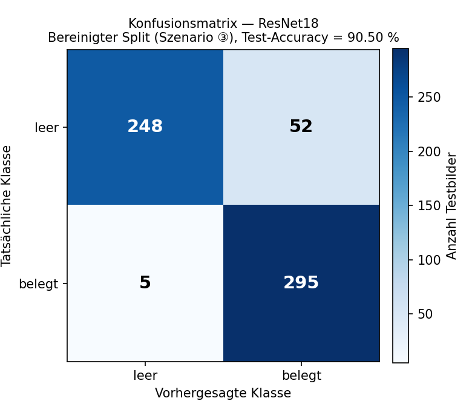
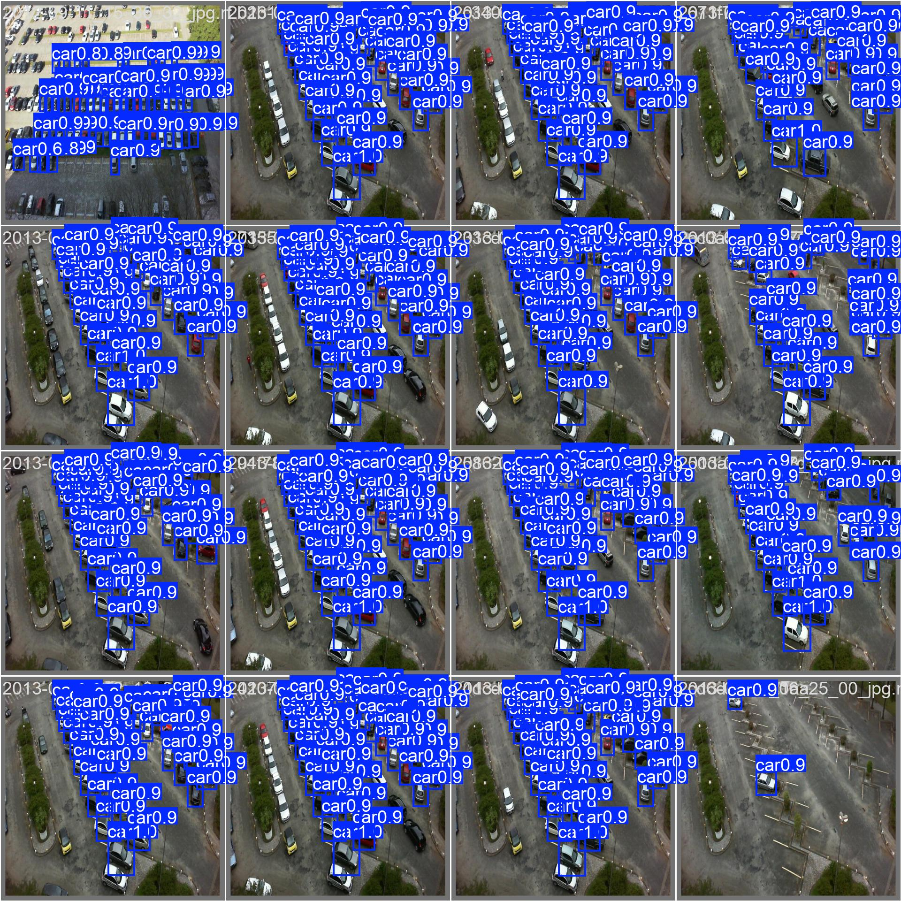
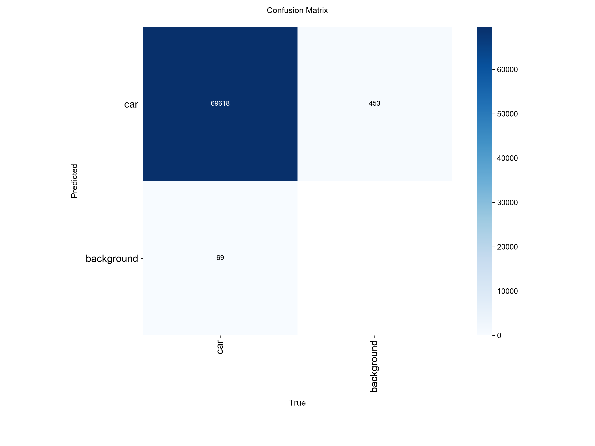
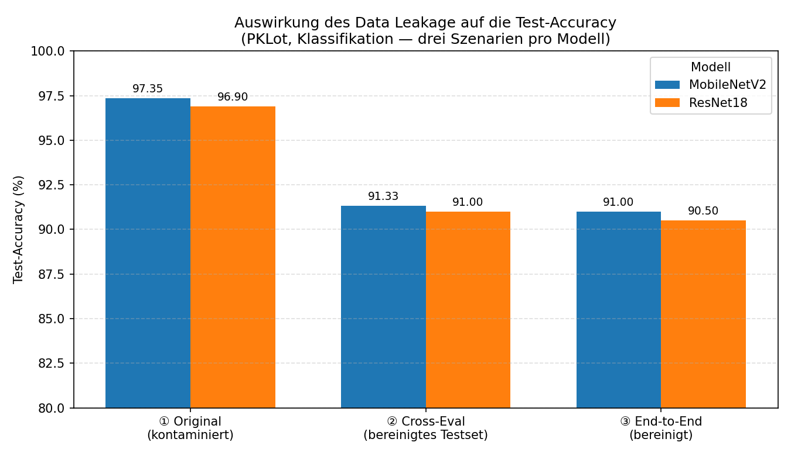

# Vergleich von Bildklassifikation und YOLO-basierter Objekterkennung zur automatischen Parkplatzbelegungserkennung

**Berliner Hochschule für Technik (BHT) — Modul Maschinelles Sehen**
**Gruppe:** Moetez Cherni, Samuel Agyei Yeboah

---

## 1. Die Projektidee

Die Suche nach freien Parkplätzen verursacht unnötigen Verkehr, Zeitverlust und CO₂-Emissionen. Moderne Computer-Vision-Methoden ermöglichen die automatische Erkennung freier und belegter Parkplätze in Echtzeit.

Dieses Projekt vergleicht zwei Ansätze zur automatischen Parkplatzbelegungserkennung auf dem PKLot-Datensatz:

- **E1 (Klassifikation)** — Ordner [`classification/`](classification/): MobileNetV2 und ResNet18 auf zugeschnittenen Einzelplätzen
- **E2 (Objekterkennung)** — Ordner [`yolo/`](yolo/): YOLOv8n auf kompletten Parkplatzszenen

**Forschungsfrage:** In welchen Szenarien ist klassische Bildklassifikation ausreichend, und wann bietet YOLO-basierte Objekterkennung entscheidende Vorteile?

---

## 2. Related Work und Datensatz

### 2.1 Related Work

Bestehende Arbeiten zeigen, dass Modelle zur Parkplatzbelegungserkennung häufig stark von der Trainingsdomäne abhängen und bei neuen Parkplätzen an Genauigkeit verlieren. Untersuchungen zu Annotationsstrategien zeigen, dass Bounding Boxes einen guten Kompromiss zwischen Aufwand und Genauigkeit darstellen (Hochuli et al., 2022). Studien auf PKLot zeigen zudem, dass YOLOv8-Ansätze mit starken Backbones sehr hohe Genauigkeit bei guter Echtzeitfähigkeit erreichen (Pokhrel & Dao, 2025; Narsingoju & Jain, 2024).

- Hochuli, A. G., de Souza, A. S., de Oliveira, L. E. S., & Britto, A. S. (2022). Deep learning-based parking lot occupancy detection: An analysis of annotation strategies. *Expert Systems with Applications*, 201, 117180.
- Narsingoju, S., & Jain, S. (2024). Smart parking system using YOLOv8 and EfficientNet backbone on PKLot dataset. *Journal of Real-Time Image Processing*, 21(3), 85.
- Pokhrel, S., & Dao, M.-N. (2025). Efficient real-time parking slot occupancy detection using YOLOv8 frameworks on the PKLot dataset. *IEEE Access*, 13, 11204–11218.
- Almeida, P., Oliveira, L. S., Silva Jr, E., Britto Jr, A., & Koerich, A. (2015). PKLot — A robust dataset for parking lot classification.

### 2.2 Datensatz

**Quelle:** PKLot-Datensatz (Kaggle, Roboflow-Export, COCO-Format) — 12.416 Parkplatz-Szenenbilder (640×640) mit Bounding-Box-Annotationen (`space-empty` / `space-occupied`). Der Datensatz selbst ist **nicht** Teil dieses Repositories (zu groß, siehe `.gitignore`) und muss lokal einmalig heruntergeladen werden (siehe Abschnitt 3).

**Vorbereitung:**
- **E1:** jede Bounding Box wurde zu einem Einzelbild zugeschnitten (Struktur `dataset/{train,val,test}/{empty,occupied}`)
- **E2:** COCO-Annotationen wurden ins YOLO-Format konvertiert (normalisierte Center-Koordinaten), Szenenbilder blieben vollständig
- Für E1 wurde auf CPU-tauglicher Größe sub-gesampelt (vollständig: ~712k Crops, zu groß)

**⚠️ Kritischer Befund — Data Leakage im Original-Split:**
Eine nachträgliche Prüfung ergab, dass der von Roboflow bereitgestellte train/val/test-Split PKLot-Aufnahmetage nicht sauber trennt: Da PKLot im 5-Minuten-Takt fotografiert, tauchten Bilder desselben Tages (gleiche Szene, gleiche geparkte Autos) sowohl im Train- als auch im Test-Set auf — 96 von 96 Test-Tagen kamen auch im Training vor. Dies führte zu einer künstlich überhöhten Test-Accuracy.

**Korrektur:** Mit `classification/build_grouped_split.py` wurde ein neuer, nach Aufnahmetag gruppierter Split erstellt (`GroupShuffleSplit`, Gruppe = Datum), der garantiert, dass kein Tag gleichzeitig in zwei Splits vorkommt:

| Split | Bildquellen | Tage | Crops (gesampelt) |
|---|---|---|---|
| train | 8.810 | 69 | 3.000 (1.500/Klasse) |
| val | 1.983 | 16 | 600 (300/Klasse) |
| test | 1.623 | 15 | 600 (300/Klasse) |

Alle in Abschnitt 4 berichteten E1-Ergebnisse basieren auf diesem bereinigten Split. Die vollständige Diagnose befindet sich in [Anhang A](#anhang-a-vollständige-leakage-diagnose).

---

## 3. Vorgehen

### 3.1 E1 — Klassifikation (MobileNetV2, ResNet18)

| Hyperparameter | Wert |
|---|---|
| Ansatz | Transfer Learning (ImageNet-Gewichte, vollständiges Fine-Tuning) |
| Optimizer | AdamW, lr=0.001 |
| Batch Size / Epochs | 16 / max. 30 (Early Stopping, Patience 5) |
| Bildgröße | 224×224 |
| Data Augmentation | Horizontal Flip + ColorJitter |
| Hardware | Windows-Laptop, CPU |

### 3.2 E2 — Objekterkennung (YOLOv8n)

| Hyperparameter | Wert |
|---|---|
| Modell | YOLOv8n (Nano) |
| Bildgröße | 640×640 |
| Batch Size / Epochs | 8 / 15 (Early Stopping, Patience 10) |
| Optimizer | SGD (YOLO-Standard) |
| Hardware | Mac M-Serie, MPS Acceleration |
| Klassen | 1 (`car`) — Belegung wird aus erkannten Fahrzeugpositionen abgeleitet |

### 3.3 Pipeline

```
PKLot Datensatz → Vorverarbeitung (Crop / YOLO-Format) → Split-Korrektur
(Leakage entfernt, Datum-Gruppierung) → Training (MobileNetV2 / ResNet18 /
YOLOv8n) → Evaluation (Accuracy, mAP, Robustheit)
```

Detaillierte Setup- und Ausführungsanweisungen: [`classification/README.md`](classification/README.md) und [`yolo/README.md`](yolo/README.md).

---

## 4. Ergebnisse und Auswertung

### 4.1 E1 — MobileNetV2 vs. ResNet18 (bereinigter Split)

| Modell | Accuracy | Precision | Recall | F1 | Parameter | Inferenz (CPU) |
|---|---|---|---|---|---|---|
| **MobileNetV2** | 91.00% | 85.34% | 99.00% | 91.67% | 2.23M | 19.7 ms |
| **ResNet18** | 90.50% | 85.01% | 98.33% | 91.19% | 11.18M | 23.9 ms |

> Auf dem ursprünglichen, nicht-bereinigten Split lagen die Werte deutlich höher (MobileNetV2 97.35 %, ResNet18 96.90 %) — dieser Unterschied ist auf Data Leakage zurückzuführen (siehe [Anhang A](#anhang-a-vollständige-leakage-diagnose)) und wird hier bewusst nicht als Hauptergebnis berichtet. Ein Zwei-Stichproben-Anteilstest auf den bereinigten Werten (z ≈ 0.30, p ≈ 0.77) zeigt, dass der Unterschied zwischen beiden Modellen statistisch nicht signifikant ist.




### 4.2 E2 — YOLOv8n

| Metrik | Wert |
|---|---|
| mAP@0.5 | 99.42% |
| mAP@0.5:0.95 | 93.51% |
| Precision | 99.77% |
| Recall | 99.77% |
| Inferenzzeit | ~30 ms (MPS) |

> **Hinweis:** Eine Data-Leakage-Prüfung für YOLO (analog zu E1) ist in Arbeit — der aktuelle Split stammt möglicherweise ebenfalls aus dem unkorrigierten Roboflow-Export. Ergebnis folgt in einem Update dieses Abschnitts.




*Echte Ausgaben des trainierten YOLOv8n-Modells (`yolo/runs/detect/yolov8n_parking/`): links eine Vorhersage auf einem vollständigen Szenenbild, rechts die Konfusionsmatrix auf dem Testset.*

### 4.3 Gesamtvergleich

| Kriterium | Baseline | MobileNetV2 | ResNet18 | YOLOv8n |
|---|---|---|---|---|
| Accuracy / mAP@0.5 | 48.2% | 91.00% | 90.50% | 99.4% |
| Input | — | Zugeschnittene Einzelplätze | Zugeschnittene Einzelplätze | Komplette Szene |
| Robustheit ggü. Perspektive/Licht | — | Mäßig | Mäßig | Hoch |
| Modellgröße | — | 2.23M | 11.18M | ~6.2M |
| Inferenzzeit* | — | 19.7 ms (CPU) | 23.9 ms (CPU) | ~30 ms (MPS) |

**Baseline-Definition:** naive Strategie ohne ML — jeder Parkplatz wird pauschal als „occupied" klassifiziert (siehe `yolo/baseline.py`). Auf dem Test-Set (36.584 empty / 34.100 occupied, 70.684 gesamt) ergibt das eine Accuracy von 34.100 / 70.684 = 48.2 %.

*\*Inferenzzeit gemessen auf unterschiedlicher Hardware (E1: Windows-CPU, E2: Mac-MPS) und Bildauflösung — der Vergleich zwischen Klassifikation und YOLO ist daher indikativ; der Vergleich MobileNetV2 vs. ResNet18 (beide auf derselben Maschine) bleibt gültig.*



### 4.4 Diskussion

Klassifikation ist ausreichend, wenn Parkplätze bereits zuverlässig zugeschnitten werden können, die Kamera-Position fest ist und maximale Einfachheit/Geschwindigkeit priorisiert wird (z. B. Embedded-Systeme). YOLO ist vorzuziehen, wenn komplette Szenen mit mehreren Plätzen, variablen Kamerawinkeln oder wechselnden Lichtverhältnissen verarbeitet werden müssen und die genaue Position der Fahrzeuge relevant ist, nicht nur der Belegungsstatus.

Innerhalb von E1 bleibt MobileNetV2 auch auf dem bereinigten Split leicht vor ResNet18 (91.00 % vs. 90.50 %), bei 5× weniger Parametern und schnellerer Inferenz — ein für mobile/eingebettete Anwendungen relevanter Vorteil, auch wenn der Unterschied statistisch nicht signifikant ist.

---

## 5. Poster und Slides

📄 **Poster (A1, PDF):** [`poster/Poster_A1_MaschinellesSehen.pdf`](poster/Poster_A1_MaschinellesSehen.pdf) *(wird vor der Posterpräsentation ergänzt)*

---

## Limitationen

- E3–E5 aus dem ursprünglichen Experimentplan (Datenaugmentation-Vergleich, stärkere YOLO-Varianten, formale Robustheitstests) wurden nicht vollständig durchgeführt. Wetter-basierte Robustheitstests (Metriken pro Wetterlage) waren geplant, wurden aber nicht umgesetzt.
- Für E1 konnte keine Wetter-Aufschlüsselung (Sunny/Cloudy/Rainy) vorgenommen werden, da keine entsprechenden Metadaten vorlagen.
- Der Data-Leakage-Check wurde bisher nur für E1 durchgeführt; die Prüfung für E2 (YOLO) ist in Arbeit (siehe Abschnitt 4.2).
- Der bereinigte E1-Split enthält nur 15–16 Tage in Val/Test — für eine statistisch robustere Aussage wäre eine Cross-Validation über mehrere Tages-Ziehungen wünschenswert.

## Fazit

MobileNetV2 und ResNet18 erreichen auf dem bereinigten PKLot-Split eine realistische Generalisierungsgenauigkeit von ca. 90–91 % bei der Einzelplatz-Klassifikation; MobileNetV2 ist bei gleichwertiger Genauigkeit aufgrund geringerer Modellgröße und Inferenzzeit vorzuziehen. YOLOv8n erzielt mit 99.4 % mAP@0.5 auf kompletten Szenenbildern eine deutlich höhere Erkennungsgenauigkeit und ist praktisch für den produktiven Einsatz auf realen Kamerabildern geeignet, während Klassifikation auf vorverarbeiteten Einzelplätzen als leichtgewichtige Alternative für kontrollierte Szenarien bestehen bleibt.

---

## Anhang A: Vollständige Leakage-Diagnose

Drei-Szenarien-Vergleich pro Modell: ① Originaler (kontaminierter) Split, ② Cross-Eval des Original-Checkpoints auf bereinigtem Testset (ohne Re-Training), ③ End-to-End neu trainiert und evaluiert auf bereinigtem Split.

| Modell | Szenario | Accuracy | Precision | Recall | F1 |
|---|---|---|---|---|---|
| MobileNetV2 | ① Original (kontaminiert) | 97.35% | 95.49% | 99.40% | 97.40% |
| MobileNetV2 | ② Cross-Eval | 91.33% | 85.23% | 100.00% | 92.02% |
| MobileNetV2 | ③ End-to-End sauber | 91.00% | 85.34% | 99.00% | 91.67% |
| ResNet18 | ① Original (kontaminiert) | 96.90% | 94.58% | 99.50% | 96.98% |
| ResNet18 | ② Cross-Eval | 91.00% | 84.75% | 100.00% | 91.74% |
| ResNet18 | ③ End-to-End sauber | 90.50% | 85.01% | 98.33% | 91.19% |

Szenario ② und ③ konvergieren für beide Modelle (Differenz < 0.5 Punkte), was einen Zufallsartefakt eines einzelnen Laufs ausschließt. Der Leakage-Effekt ist bei beiden Architekturen nahezu identisch (MobileNetV2: −6.18, ResNet18: −6.15 Punkte), was auf eine Eigenschaft des Splits statt der Modellarchitektur hindeutet.

Rohdaten: [`classification/results/leakage_diagnostic_mobilenet_v2.json`](classification/results/leakage_diagnostic_mobilenet_v2.json), [`classification/results/leakage_diagnostic_resnet18.json`](classification/results/leakage_diagnostic_resnet18.json), [`classification/results/leakage_crosseval_mobilenet_v2.json`](classification/results/leakage_crosseval_mobilenet_v2.json), [`classification/results/leakage_crosseval_resnet18.json`](classification/results/leakage_crosseval_resnet18.json)

## Anhang B: Reproduzierbarkeit

**E1** (`classification/`): `config.py`, `utils.py`, `prepare_dataset.py`, `build_grouped_split.py`, `train.py`, `evaluate.py`, `compare.py`, `leakage_crosseval.py`, `leakage_diagnostic_train.py` — Details siehe [`classification/README.md`](classification/README.md)

**E2** (`yolo/`): `baseline.py`, `train_yolo_mac.py`, `evaluate_yolo_mac.py` — Details siehe [`yolo/README.md`](yolo/README.md)

**Software:** PyTorch, Ultralytics YOLOv8, scikit-learn, OpenCV, NumPy, Pandas
